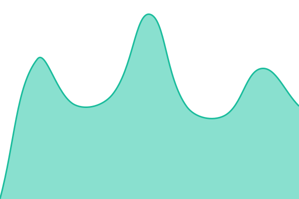

# [📈 Estado actual](https://status.kotodama.dev): <!--live status--> **Todos los sistemas operativos**

This repository contains the open-source uptime monitor and status page for [gitkotodama](https://status.kotodama.dev), powered by [Upptime](https://github.com/upptime/upptime).

With [Upptime](https://upptime.js.org), you can get your own unlimited and free uptime monitor and status page, powered entirely by a GitHub repository. We use [Issues](https://github.com/gitkotodama/kotodama-status/issues) as incident reports, [Actions](https://github.com/gitkotodama/kotodama-status/actions) as uptime monitors, and [Pages](https://status.kotodama.dev) for the status page.

## [📈 Live Status](https://demo.upptime.js.org): <!--live status--> **Todos los sistemas operativos**

<!--start: status pages-->
<!-- This summary is generated by Upptime (https://github.com/upptime/upptime) -->
<!-- Do not edit this manually, your changes will be overwritten -->
<!-- prettier-ignore -->
| URL | Status | History | Response Time | Uptime |
| --- | ------ | ------- | ------------- | ------ |
|  [Web pública](https://kotodama.dev/) | Operativo | [web-publica.yml](https://github.com/gitkotodama/kotodama-status/commits/HEAD/history/web-publica.yml) | 

 852ms
     
 | 

<a href="https://status.kotodama.dev/history/web-publica">100.00%</a>
    

|  [Kotodama](https://kotodama.dev/health) | Operativo | [kotodama.yml](https://github.com/gitkotodama/kotodama-status/commits/HEAD/history/kotodama.yml) | 

 499ms
     
 | 

<a href="https://status.kotodama.dev/history/kotodama">100.00%</a>
    

<!--end: status pages-->

[**Visit our status website →**](https://status.kotodama.dev)

## 📄 License

- Powered by: [Upptime](https://github.com/upptime/upptime)
- Code: [MIT](./LICENSE) © [Anand Chowdhary](https://anandchowdhary.com)
- Data in the `./history` directory: [Open Database License](https://opendatacommons.org/licenses/odbl/1-0/)
